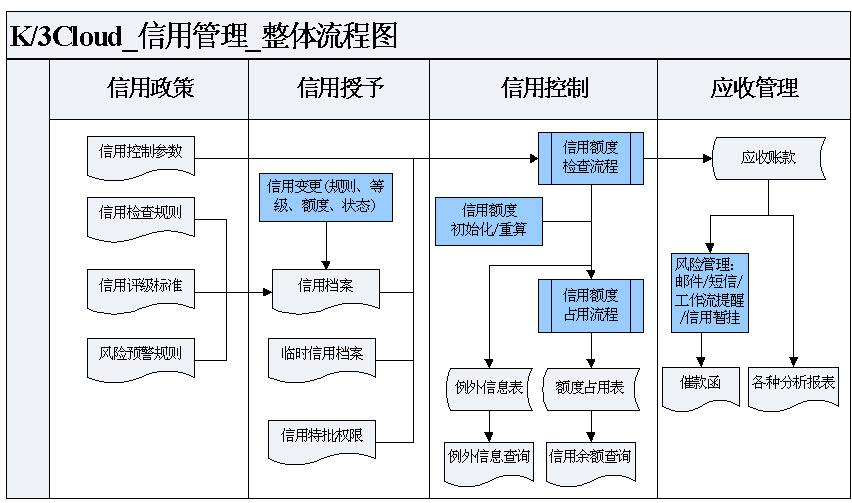

 1 信用管理概述 

**信用管理概述

信用管理系统，是通过信用检查规则、信用档案、信用特批权限、信用初始化、信用重算、信用状况查询、例外信息查询、业务单据中的信用查询以及信用评估、信用控制等功能的综合运用，对信用管理全过程进行有效控制和跟踪，从而建立完善的信用管理体系。

**信用管理总体流程图**

金蝶云信用管理帮助企业建立完善的信用管理体系，从而有效实现信用管理目标。

  * 信用控制范围说明

| 信用控制范围 | 控制范围说明         | 
| -------- | ----------------         |
| 组织范围 | 按业务组织进行信用控制。        |
| 法人范围 | 按法人组织对法人组织及其下属业务组织进行信用控制。         |
| 集团法围 | 按整个集团进行信用控制，包括：集团组织本身、下属法人组织以及业务组织。         | 

主要功能包括：

信用政策—信用控制参数、信用检查规则；

科学授信—信用档案、信用特批权限、临时授信、信用变更；

信用控制—信用初始化、信用重算、信用检查、信用额度更新；

信用查询—单据的信用查询、信用状况查询、信用明细查询、例外信用查询、信用总额特批情况查询；

信用评估—信用评估指标、信用评估等级设置、信用评估模型、信用评分。

 2 业务类型及应用 

 2.1 多控制范围信用控制

满足多业务组织、多管理层级对信用管理对象进行不同信用额度控制的需求。

 2.2 多维度信用控制对象 

满足对多个信用对象(客户、销售员…)进行信用额度控制的需求。

  * 信用控制对象说明

| **控制对象名称**     || **控制对象说明**              |
| 客户             || 按客户进行信用控制               |
| 集团客户           || 按集团客户本身以及其下属客户进行总的信用控制  |
| 客户+物料          || 按客户+物料进行信用控制            |
| 客户+物料分组        || 按客户+物料分组进行信用控制          |
| 销售员            || 按销售员进行信用控制              |
| 销售组            || 按销售组进行信用控制              |
| 销售部门           || 按销售部门进行信用控制             |
| 销售组织           || 按销售组织进行信用控制             |

 2.3 集团客户多层级信用控制 

满足企业面对的客户是跨地域经营的集团企业时，可以针对客户单独进行管理，也可以对客户集团进行统一的集团信用管理。

  * 当公司面对的客户是集团客户，且和集团客户的下级客户也有发生交易时。如果信用控制的对象是针对集团客户一个总的额度，其下级客户都共同使用这个额度；这种场景下，在信用参数勾选信用控制对象对集团客户选项，在设置信用档案时，控制对象那里要选择集团客户，去针对公司的集团客户设置信用额度。

  * 如果集团客户下，发生业务的集团子客户也各有控制额度，则在设置信用档案时，同时设置集团客户额度+客户额度二个维度进行控制，即可实现。

 2.4 多形式的信用控制
 
信用控制支持多种形式的信用控制

  * 支持多业务环节(单据)：可根据业务实际，选择需要参与信用管控的业务单据； 

  * 支持多应用场景(单据类型)：可进一步细分，参与信用管控的业务单据的单据类型； 

  * 支持多控制时点：可选择信用控制时点，“提交”或“审核”时进行信用管控； 

  * 支持多控制强度： 预警提示、密码特批、取消交易、信用冻结； 

  * 支持多控制指标：信用额度、逾期额度、单笔限额、按逾期应收比例控制、逾期天数等； 

  * 支持信用额度动态调节：信用调节系数；

  * 支持信用公式自定义扩展：按业务需要增加信用管控自定义单据；可支持自定义信用占用公式，增加信用占用额度或是反向扣减信用占用额度。

 3 信用业务专题 

**信用检查**

信用检查根据信用检查规则和信用档案，在业务发生时判断是否满足企业的信用风险管理要求，并进行相应的控制。

  * 使用前提:

设置客户档案勾选【启用信用管理】参数； 

已设置信用检查规则； 

已设置信用档案。
 
  * 应用场景：

根据信用控制范围、信用控制对象在信用档案设置的检查规则、信用额度、信用比例以及信用控制强度等进行信用控制检查。

  * 信用检查规则在信用控制中的应用：

系统预置了一套检查规则，建议客户可以按自己的需要新建一套检查规则。并不是控制维度设的越多越好，而且按用户销售业务流程的需要进行设置，相反如果控制项目较多，同时也会导致信用计算性能变慢。

  * 单据中的信用检查和控制

设置信用检查规则及信用档案后，在信用单据提交或审核时就会检查和控制信用了。一般情况下，信用单据都提供信用查询功能，可以查看当前单据所对应的信用档案的信用占用状况。

**信用额度更新**

信用额度更新是在信用检查通过后，即可占用该信用控制对象的信用额度，以便下次新业务发生时，能综合考虑已用额度情况。

  * 使用前提:

设置客户档案勾选【启用信用管理】参数；
 
已设置信用检查规则； 

已设置信用档案。
 
 * 额度更新处理逻辑：

信用额度更新依据：

根据销售组织、信用对象的信用检查规则、单据、单据类型，判断信用对象是否更新额度。
 
 * 系统预置的业务单据更新信用额度处理逻辑：

销售订单、发货通知单、销售出库单、应收单、退款单等增加信用额度；

退货通知单、退货单、收款单减少信用额度；

业务单据在提交/审核操作时增加信用额度；

反审核操用时减少信用额度；

销售订单在业务关闭、业务终止时减少信用额度；在业务反关闭，业务反终止时增加信用额度；

发货通知单在业务关闭时减少信用额度，反关闭时增加信用额度。

**信用评估**

客户信用评估是为了加强信用控制，对客户的偿债能力、履约状况、守信程度的评价。通过信用评估指标设置、信用等级标准、信用评估模型、信用评分等对用量化的数值来体现所评估对象的信用风险。

  * 使用前提:

设置客户档案勾选【启用信用管理】参数； 

设置信用评估指标： 

设置信用等级标准； 

建立信用评估模型。
 
  * 信用评估体系的构建应用：

信用评估指标：  

信用评估指标支持树目录结构展示； 

支持多层指标的制定； 

支持定性指标、定量指两种指标类型。

信用等级标准：

支持设置多套等级标准； 

可按信用控制层级（业务组织、法人组织或集团）设置在相应信用等级下的信用检查规则、信用控制额度，实现批量授信。

信用评估模型：

按用户定义个性评估模型； 

评估模型可以选择不同的指标，系统自动带出上级指标；
 
评估模型支持指标分值、权重的设置。

信用评分：

系统提供向导引导用户创建信用评分表；
 
信用评分表支持多人评分
; 
信用评分表预留接口，支持用户自定义评估指标取系统数据进行评分;
 
信用评分结果可以自动更新到信用对象信用档案的信用等级里，可以按信用等级进行信用授信及额度控制。

**信用预警**

通过信用预警机制，满足企业对客户信用状况数据进行判断，自动发出预警信息给相应人员，企业人员可以轻松实行催款、催缴以及客户信用评估的考核。

  * 使用前提:

设置预警方案； 

启用信用预警。
 
  * 风险预警方案应用：

可以按信用对象设置预警方案； 

根据预警方案自动触发预警，自动发送信息并进行后继业务环节的处理； 

信用审核不通过时，可发送信息提示（工作流、邮件、短信）给相关人员。

 4 信用操作手册 

 4.1 使用流程

**信用管理使用流程** 

  * 第一步，设置基础数据 

在系统使用前，我们需要先设置基础数据。 

1 首先，设置的公共的基础档案，包括：组织信息、客户信息、部门、业务员等； 

2 进入基础管理－>基础资料设置； 

3 设置信用管理参数； 

参数设置，进入【基础设置】－>【公共设置】－>【参数设置】－>【供应链】－>【信用管理】。

  * 第二步：客户档案启用信用管理参数 

1 在客户档案—商务页签中勾选“启用信用管理”：勾选该参数则表示该客户需进行信用管理，必须在信用档案中维护该客户的授信情况；如不勾选，则表示该客户不需进行信用管理，无需在信用档案中进行授信。新增客户档案，该选项默认勾选； 

2 客户档案启用信用管理，进入【基础资料】－>【客户】－>【商务信息页签】－>【启用信用管理】。

  * 第三步：设置信息管理基础数据，包括：信息检查规则、信息档案、信息特批权限 

1 进入供应链－>信用管理－>信用检查规则； 

2 进入供应链－>信用管理－>信用档案设置； 

3 进入供应链－>信用管理－>信用特批权设置

  * 第四步，日常业务操作 

1 首先根据信用检查规则、信用档案设置，完成信用初始化，计算截止至启用日期，信用对象占用信用额度情况； 

信用初始化，进入【供应链】－>【信用管理】－>【信用管理】－>【信用初始化】；  

2 其次根据信用检查规则、信用档案设置，在销售业务过程中，进行信用额度更新，并进行信用检查； 

3 当信用参数调整或信用余额异常时，进行信用重算； 

信用重算，进入【供应链】－>【信用管理】－>【信用管理】－>【信用重算】； 

4 通过信用状况查询，可即时查询信用对象的信用状况；通过例外信息查询，可查询信用检查情况及信用特批处理情况； 通过信用总额特批情况查询，可以查询信用总额特批情况明细。

信用状况查询，进入【供应链】－>【信用管理】－>【信用查询】－>【信用状况查询】； 

例外信息查询，进入【供应链】－>【信用管理】－>【信用查询】－>【例外信息查询】 ；

信用总额特批情况查询，进入【供应链】－>【信用管理】－>【信用查询】－>【信用总额特批情况查询】 ；

5 通过信用评估，可以评估客户信用等级。 

信用评估，进入【供应链】－>【信用管理】－>【信用评估】－>【创建信用评分表】

 4.2 基础设置

[[信用管理系统参数]]  

[[信用检查规则]]  

[[信用档案]]  

[[客户物料信用档案]]  

[[销售员客户信用档案]] 

[[销售组客户信用档案]]

[[信用特批权限]] 

[[临时信用档案]]  

[[信用变更]]  

 4.3 业务资料设置

[[信用初始化]] 

[[信用重算]]

[[信用总额特批]] 

[[信用月结控制计算]]

[[信用额度占用表数据清理]]

[[信用额度占用表数据反清理]]

[[信用占用表数据清理单据查询]]

[[信用评估]] 

[[信用异常检查工具]] 

 4.4 报表分析

[[信用状况查询]] 

[[信用额度占用明细查询]]

[[例外信息查询]]

[[信用总额特批情况查询]] 

